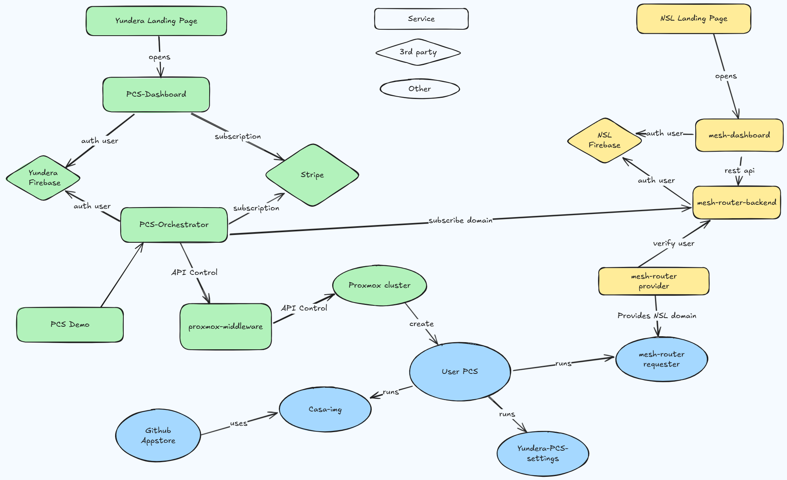

# 🌐 Yundera

**Personal Cloud Server Platform for Self-Hosting and Data Privacy**

This repository is the monorepo for the Yundera project, it contains the core components and applications that make up the Yundera ecosystem.

---

## 🎯 What is Yundera?

Yundera helps you set up your Personal Cloud Server (PCS), own your data, and easily setup open source apps. From websites like WordPress, AI like Llama or Deepseek, or just data like NextCloud, own your data. We take care of everything in one click: from your domain to security. Perfect for self-hosting and data privacy.

**Key Features:**
- 🔐 **Data Ownership** - Your data stays private and protected
- 🚀 **One-Click Setup** - Pre-configured domain, security, routing, and applications
- 🛠️ **Open Source Applications** - WordPress, Plex, AI models, file sharing, and more
- 🌍 **Self-Hosting Made Easy** - No technical expertise required
- 💰 **Cost Control** - Pay for what you use, starting from $24.99/month

---

## 🏗️ Architecture Overview

Yundera operates on a distributed architecture with two main deployment targets:

### 🖥️ Yundera Server Components
*Components deployed on the Yundera infrastructure*

| Component | Description |
|-----------|-------------|
| **landing-page** | Public-facing website and marketing portal |
| **user-panel** | Web-based user management interface |
| **user-panel-backend** | API backend for user management operations |
| **v-PCS-orchestrator** | Virtual Personal Cloud Server orchestration engine |
| **mesh-router** | Network routing and domain management for server infrastructure |

### 🏠 Personal Cloud Server (PCS) Components
*Components deployed on user's personal cloud servers*

| Component | Description |
|-----------|-------------|
| **casa-img** | CasaOS containerized environment for application management with automatic subdomain assignment |
| **mesh-router** | Local network routing and container domain management |
| **settings-center-app** | Yundera management application for PCS configuration |

---

**Learn More:**
- 🌐 [Official Website](https://yundera.com)
- 📚 [Documentation](https://nsl.sh/more)

---

## 🛠️ Development

Each component is containerized and automatically built through GitHub Actions. The system uses Docker for deployment and includes comprehensive CI/CD pipelines.

**Technology Stack:**
- Docker & Docker Compose
- Mesh networking for distributed routing
- Container orchestration
- Automated domain and SSL management

---

## 📦 Archuitecture

