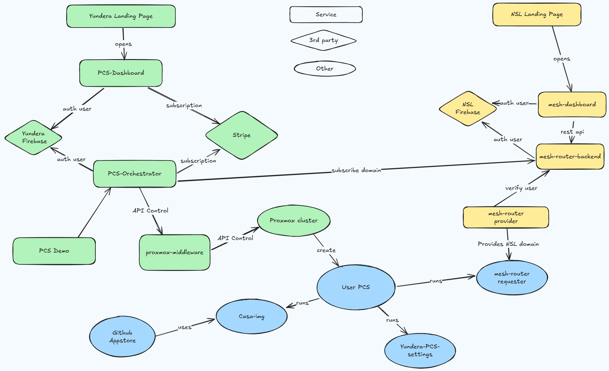

# 🌐 Yundera - A plug-and-play Private Cloud Server with built-in open-source apps

**Personal Cloud Server Platform for Self-Hosting and Data Privacy**

  

Own your server. Own your data. Run open source apps without the complexity on a pre-configured CasaOS interface.
Connect your apps, keep control of your data, reduce SaaS costs, and build AI workflows on your own private cloud server, ready to use.

**[Website](https://yundera.com) | [Demo](https://app.yundera.com/demo) | [GitHub](https://github.com/yundera)**

This repository is the monorepo for the Yundera project, it contains the core components and applications that make up the Yundera ecosystem.

---

## What is Yundera?

Yundera helps you set up your Personal Cloud Server (PCS), own your data, and easily install open-source apps. From websites like WordPress or Odoo, to photos with Immich, to file sync with Nextcloud — we take care of everything in one click: from your domain to security. Perfect for self-hosting and data privacy.

**Key Features:**
- 🔐 **Data Ownership** — Your files, apps, and AI models run on your server. No data mining. No vendor lock-in.
- 🚀 **One-Click Setup** — Pre-configured domain, security, routing, and applications. Install curated open-source apps like Immich, Nextcloud, Jellyfin, Navidrome, Mealie, Vaultwarden, and AI services.
- 🛠️ **Built on Docker** — Run thousands of open-source applications from the Docker ecosystem.
- 🌍 **Self-Hosting Made Easy** — No technical expertise required. WordPress, Odoo, Plex, AI models, file sharing, and more — all accessible through a clean CasaOS interface.
- 💰 **Cost Control** — Pay for what you use.
- 🌐 **Your Own Domain** — Every server runs on a personal domain like `yourname.nsl.sh`.

It removes the hardest parts of self-hosting:
- Server setup  
- Security configuration  
- App deployment  
- Domain routing  
- Maintenance overhead  
So you can focus on using your tools, not maintaining them.

## Why do you need a Private Cloud Server?

Over the last few years, three major shifts became impossible to ignore:

- Cloud services became fragmented and expensive  
- Data ownership quietly disappeared behind SaaS platforms  
- Running open-source tools still required server expertise  

Today, your files live on one service, your website on another, your emails somewhere else, and your AI tools train on data you do not control. Costs grow. Control shrinks.

Yundera started with a simple question:

**What if anyone could own a server as easily as using a cloud service, but without giving up their data?**

Yundera provides a **Private Cloud Server**, preconfigured and ready to use, that lets individuals and businesses host their own storage, websites, collaboration tools, and AI services on their own domain.

Your server is not a service.  
It is infrastructure you own.

## Philosophy

We strongly believe that:
- Open-source tools should be accessible to everyone  
- Data sovereignty matters more in the age of AI  
- Simplicity beats complexity

---

## 🏗️ Architecture

Yundera is split across two deployment tiers: shared Yundera infrastructure, and the Personal Cloud Server (PCS) that runs on each user's machine.

### 🖥️ Yundera Server tier
*Runs on Yundera's cloud infrastructure.*

| Component | Path | Role |
|---|---|---|
| **mesh-router-backend** | [`packages/mesh-router-root`](./packages/mesh-router-root) | Domain management API, Firebase auth, libp2p signature verification |
| **mesh-router-gateway** | [`packages/mesh-router-root`](./packages/mesh-router-root) | SSL termination and dynamic domain resolution (OpenResty + Lua) |
| **pcs-orchestrator** | [`packages/pcs-orchestrator`](./packages/pcs-orchestrator) | PCS VM lifecycle (create / reboot / delete) over SSH + Proxmox |
| **proxmox-middleware** | [`packages/proxmox-middleware`](./packages/proxmox-middleware) | FastAPI abstraction over the Proxmox cluster API |
| **demo** | [`packages/demo`](./packages/demo) | Scheduled cleanup and re-provisioning of demo PCS instances |
| **yundera-smtp-handler** | [`packages/yundera-smtp-handler`](./packages/yundera-smtp-handler) | Container that handles outbound SMTP for Yundera services |
| **web3/soroban** | [`packages/web3/soroban`](./packages/web3/soroban) | Stellar/Soroban smart contracts + Astro frontend for on-chain payments |

### 🏠 Personal Cloud Server (PCS) tier
*Deployed onto every user's PCS.*

| Component | Path | Role |
|---|---|---|
| **casa-img** | [`packages/casa-img`](./packages/casa-img) | Custom CasaOS distribution — manages installed apps and assigns subdomains automatically |
| **mesh-router** (local) | [`packages/mesh-router-root`](./packages/mesh-router-root) | Local SSL termination, domain routing, WireGuard tunnels to other PCS |
| **settings-center-app** | [`packages/settings-center-app`](./packages/settings-center-app) | Admin dashboard shipped inside each PCS (SSH, Docker Compose, health checks) |
| **pcs-dashboard** | [`packages/pcs-dashboard`](./packages/pcs-dashboard) | User-facing PCS dashboard UI |
| **template-root** | [`packages/template-root`](./packages/template-root) | VM template init scripts and Compose templates |

Most `packages/*` entries are independent git submodules — clone with `--recursive`, and see [CLAUDE.md](./CLAUDE.md) for the submodule workflow and per-package build commands.

---

**Learn More:**
- 🌐 [Official Website](https://yundera.com)
- 📚 [Documentation](https://nsl.sh/more)
- 🏛️ [Infrastructure docs](./doc)

## Roadmap
📚 [Roadmap](https://yundera.com/roadmap)

---

## Use Cases

- Personal cloud storage  
- Photo and media libraries  
- Private websites and portfolios  
- Team collaboration tools  
- Self-hosted AI assistants  
- Freelancers and small businesses  
- Education and learning environments  

---

## Getting Started

Yundera servers are fully preconfigured and delivered ready to use.

No installation required.  
No command line needed.

1. Create your server  
2. Access your dashboard  
3. Install apps with one click  

## Community

If you believe data ownership and open source matter, support the project:

- ⭐ Star the repository  
- 🍴 Fork it  
- 💬 Join the community discussions  

Yundera is built for people who want control without complexity.

