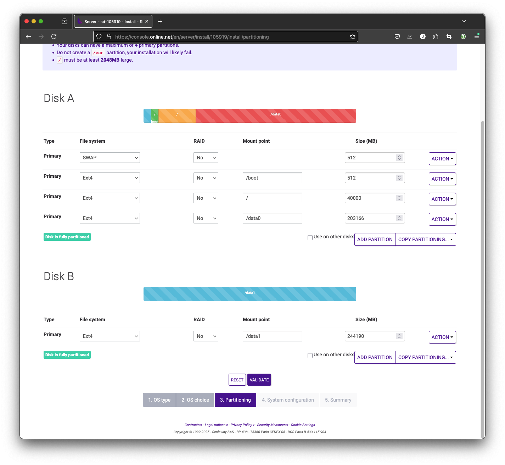
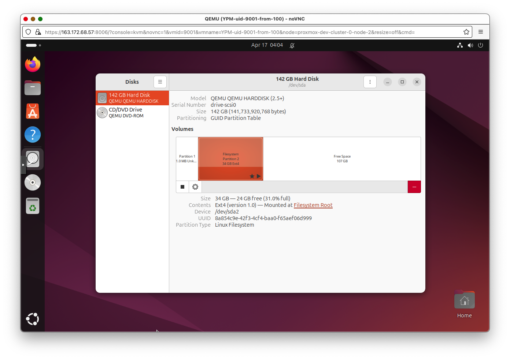

# setup

# Create Developer SSH Key

On your Mac or Linux machine:

```bash
ssh-keygen -C "admin@aptero.co"
```

It will ask:

```bash
Generating public/private ed25519 key pair.
Enter file in which to save the key:
```

Name the key pair something memorable like `yundera-developer` 

Passphrase is optional but recommended.

This will create two files in `~/.ssh:`

```bash
yundera-developer
yundera-developer.pub
```

The *.pub file is the public key that you need to upload to Scaleway and attach to your server when you create the server.

The file without the *.pub extension is the private key.

# Rent Servers

Rent three Scaleway Dedibox START-2-L servers and one START-1-L server.

The START-2-L servers will be used for Proxmox VE cluster, and the START-1-L server will be used as a Proxmox Backup Server (PBS). This documentation covers the Proxmox VE cluster installation. Please see separate documentation for PBS setup.

This section does not have an automated playbook because Scaleway Dedibox rental is a month-long commnitment and initial OS install can take up to 1 hour. These considerations made it infeasible to build and test automated scripts within the scope of this report.

Should that become a relevant goal, Scaleway offers its own APIs and the Terraform has a Scaleway provider already built-in, which will make the task straightforward.

Sign into [https://console.online.net/en/login](https://console.online.net/en/login)


Since the latest version of Proxmox VE that Scaleway offers pre-installed is an outdated (7.x) one, we will install Proxmox VE 8.x ourselves from a Debian 11 base installation. In the process we’ll upgrade Debian from 11 to 12 also.




The default partitioning uses RAID1. Disable this.

The first drive will contain Swap, /boot, and / partitions, along with a /data0 partition. Keep the / partition relatively small (40GB) and fill the rest with /data0 partition.

The second drive will have just one /data1 partition.

The /data0 and /data1 partitions will be wiped later and used for Ceph.


Change the hostname to something more meaningful. Pick a username and password and keep them somewhere safe.


In addition, we need to set up SSH key access to the server. Click `or add a new one here` button. Copy the contents of the public SSH key (`yundera-developer.pub` in the previous step) here.


Confirm in summary and wait until the servers boot up and installs the OS. The website says this can take up to an hour. Typically it takes around 15 to 30 minutes.

Repeat this for all servers.

# Install Proxmox VE 8

We use Ansible to automate the installation and upgrade of Proxmox VE 8.

We prefer starting from a Debian image instead of using the provided Proxmox VE 7 image because it allows us to use Ansible for more things.

This code for this section is:

[https://github.com/tensorturtle/yundera-limitless-pc](https://github.com/tensorturtle/yundera-limitless-pc)

Please read the ‘README.md’ inside the ‘ansible’ directory.

Ansible running on all three servers:


Once Ansible is finished, navigate to the web interface, which is at port 8006 on each of the servers’ public IP addresses:

Proxmox uses self-signed certificates which web browsers don’t like - we can safely ignore this and it won’t bother us again.


Log in using the root password (which you defined when renting the server)


Ignore warning for subscription.


At this point, we should be able to access all three Proxmox web UIs.

# Create Proxmox Cluster

This step cannot be automated via Ansible due to a quirk of the ‘pvecm’ command - specifically, it requires the root password to be entered (even when key-based SSH is set up between the servers) but it cannot be scripted with STDIN or even ‘expect’. More work is required to find a workaround.

Log into the first of the three hosts. We should see a single host in the ‘Datacenter’ list.


Create a new cluster.


Pick a cluster name of your choice.


Copy the “Join Information” field.


Now log into the Proxmox web UI of the other two hosts.

In the same Cluster settings, join the cluster by pasting in the ‘Join Information’ content.


Enter the root password of the first host when prompted.


## Using Command Line

The same process can be done through the command line.

SSH into the first node (node 0) as root.

Create a new cluster

```bash
pvecm create YUNDERACLUSTER
```

View status

```bash
pvecm status
```

Note the IP address of this ‘leader’.

SSH into the other hosts

```bash
pvecm add LEADER.IP.ADDRESS.HERE
```

Enter root password for the leader.

Go back to the leader node and run `pvecm status` to see the new node in the cluster.

The cluster should now look like this (the cluster is visible from all nodes)


Equivalently, we can run

`pvecm status`:

```bash
root@proxmox-dev-cluster-0-node-0:~# pvecm status
Cluster information
-------------------
Name:             YUNDERACLUSTER
Config Version:   3
Transport:        knet
Secure auth:      on

Quorum information
------------------
Date:             Sat Mar 29 16:02:14 2025
Quorum provider:  corosync_votequorum
Nodes:            3
Node ID:          0x00000001
Ring ID:          1.d
Quorate:          Yes

Votequorum information
----------------------
Expected votes:   3
Highest expected: 3
Total votes:      3
Quorum:           2
Flags:            Quorate

Membership information
----------------------
    Nodeid      Votes Name
0x00000001          1 163.172.68.57 (local)
0x00000002          1 163.172.68.59
0x00000003          1 163.172.68.106
```

# Create Ceph Cluster on top of Proxmox Cluster

[Deploy Hyper-Converged Ceph Cluster - Proxmox VE](https://pve.proxmox.com/wiki/Deploy_Hyper-Converged_Ceph_Cluster)

## Wipe Second Drive

Our servers came installed with two SSDs. 

One is used by the host system, and the other will be dedicated to Ceph.

Since we had to format it to ext4 in the setup stage, we wipe it again to be used for Ceph.

Go to ‘Disks’ and select the drive that has just one partition. Then click ‘Wipe Disk’.


## Install Ceph on all machines


Select the latest version (squid) and No-subscription. Uncheck ‘Advanced’.


Repeat for all servers.

# Create Ceph Cluster

We’ll have one monitor, three managers (one main, two standby), and three OSDs.

If you are unfamiliar with Ceph terms, please see the [documentation](https://docs.ceph.com/en/squid/start/)

Add another manager:


Add OSD for each server. For this step, go to each node’s Ceph settings and add the empty hard drive.


Create Metadata servers (one active, two standby). Then, create a CephFS storage. CephFS storage is a simple shared file system among the nodes. We will use it to store the VM image base ISOs.


Create a new pool for RBD, which is where the VMs will store their state. 

Note: All Ceph related changes are shared across all nodes, so we can do these operations from any node’s Proxmox web UI.

Note that CephFS storage is different from the Ceph RBD storage we defined above. CephFS is just a convenient shared directory to keep metadata like OS ISOs, and RBD is where the actual VMs will store their content.

First, create a Ceph pool. Keep defaults.


Go to Datacenter → Storage, and add a new “RBD” storage, using cephpool.


## Configure network for VMs

Follow the directions given this Proxmox documentation, starting from the ‘**Configuration’** section.

[https://pve.proxmox.com/wiki/Setup_Simple_Zone_With_SNAT_and_DHCP](https://pve.proxmox.com/wiki/Setup_Simple_Zone_With_SNAT_and_DHCP)

Notes:

- The first part, installing `dnsmasq` , is not necessary because it is already done by the initial Ansible setup.
- When defining the subnet, consider using a larger subnet mask like /16 to allow for a bigger network, such as:
    
    
    
    
    
- IP forwarding is required, which is done by: `echo 1 > /proc/sys/net/ipv4/ip_forward`  This was already applied in the initial Ansible playbooks, so we don’t have to worry about it
- Remember to ‘Apply’ changes from the ‘SDN’ view.

# Create a VM

## Download OS ISOs

Upload a Ubuntu 24.04 LTS image to the CephFS storage. Since that storage is shared, it means that all hosts within this cluster will be able to launch VMs using that ISO.

From France, a convenient download URL mirror is: [https://mirror.bakertelekom.fr/Ubuntu/24.04/ubuntu-24.04.2-desktop-amd64.iso](https://mirror.bakertelekom.fr/Ubuntu/24.04/ubuntu-24.04.2-desktop-amd64.iso)


Upload it to the CephFS. Since it’s a shared storage location, now all hosts will be able to create VMs based on this ISO without copying.


## Create VM

Press ‘Create VM’ button


Use the previously uploaded ISO in cephfs:


In System, select ‘Qemu Agent’. This simply enables Proxmox to contact a QEMU agent that runs inside the guest. We need to install the actual qemu agent ourselves later.


In Storage, select the Ceph RBD. The disk size is not meaningfully changeable after this, so pick carefully. (More accurately, we can change the disk size but we cannot change the boot partition without rebooting and complex steps)


In CPU, enter the maximum number of cores that will ever be used by this VM at the top ‘Cores’. It cannot exceed the number of physical cores on the host.

 Enter the actually allocated number of cores in the bottom ‘VCPUs’.

Enable NUMA.


In Memory, ensure Ballooning Device is selected.


In Network, a vnet created in the above SDN (Software Defined Network) should show up. This can be thought of as an internal network for the VMs, with the Proxmox cluster providing an internet gateway and a DHCP server.

Enable Firewall to disable inter-VM traffic.


Finish VM creation. Don’t start it yet.

Select the newly created VM in the Server View and open Options → Hotplug.


Enable everything including Memory and CPU.

Now we are ready to install the OS. Press ‘Start’ on this VM and open the Console.

Keep sensible defaults for the OS.

**Clean the image for use as template**

`clean_for_template.sh`

```bash
apt clean

# Delete temp files
rm -rf /tmp/*
rm -rf /var/tmp/*

# Reset machine-id
truncate -s 0 /etc/machine-id
rm -f /var/lib/dbus/machine-id

# Remove random seed files
rm -f /var/lib/systemd/random-seed
rm -f /loader/random-seed

# Remove system identity files
rm -rf /var/lib/cloud/instance*

# Remove credential secret
rm -f /var/lib/systemd/credential.secret

# Reset SSH host keys
rm -f /etc/ssh/ssh_host_*

```

We’ll be using this script often (any time we create a template), and we will refer to it as `clean_for_template.sh` henceforth.

---

CHECKPOINT: We save the VM in this current state as VMID 100 (base-ubuntu-24)

---

All templates have their SSH keys wiped, so we need to ensure that at the first boot of a clone of a template VM, the keys are created again. The command to do this is:

```bash
sudo dpkg-reconfigure openssh-server # DON'T RUN THIS NOW
```

It is idempotent in the sense that it will do nothing if keys already exist. Therefore we can create a startup systemd service to run it, and we can expect it to run at the first boot (after being cloned from the template).

`etc/systemd/system/regenerate_ssh_host_keys.service`:

```bash
[Unit]
Description=Regenerate SSH host keys on boot if it doesn't exist.
After=network.target

[Service]
Type=oneshot
ExecStart=/usr/sbin/dpkg-reconfigure openssh-server
RemainAfterExit=yes

[Install]
WantedBy=multi-user.target
```

Just enable it without starting it. Note that if you restart this server, the keys will obviously be recreated due to this script, so run the `clean_for_template.sh` if you do reboot.

```bash
sudo systemctl enable regnerate_ssh_host_keys.service
```

Install OpenSSH:

```bash
sudo apt install openssh-server
sudo systemctl enable ssh.service
sudo systemctl start ssh.service
```

These are all just bash commands, so we can do it from the VM’s own terminal, or SSH into it from the host. At this point, the VM doesn’t have an IP address so we won’t be able to SSH into it from outside the cluster.

Install QEMU agent. This allows the hypervisor to communicate with the VM and we use it later on.

```bash
sudo apt install qemu-guest-agent
sudo systemctl enable qemu-guest-agent
sudo systemctl start qemu-guest-agent
```

## Guest VM Modifications for Vertical Scaling

[https://pve.proxmox.com/pve-docs/chapter-qm.html#_vcpu_hot_plug](https://pve.proxmox.com/pve-docs/chapter-qm.html#_vcpu_hot_plug)

On ubuntu 24, only one “cpu” line is needed.

```bash
echo 'SUBSYSTEM=="cpu", ACTION=="add", TEST=="online", ATTR{online}=="0", ATTR{online}="1"' > /lib/udev/rules.d/80-hotplug-cpu-mem.rules
```

On Debian 12, the additional line 

```bash
echo 'SUBSYSTEM=="memory", ACTION=="add", TEST=="state", ATTR{state}=="offline", ATTR{state}="online"' > /lib/udev/rules.d/80-hotplug-cpu-mem.rules
```

Is required. The [https://pve.proxmox.com/wiki/Hotplug_(qemu_disk,nic,cpu,memory)](https://pve.proxmox.com/wiki/Hotplug_(qemu_disk,nic,cpu,memory)) docs say that the memory line is only required for kernel older than 4.7, but on Debian 12 with Kernel 6.1, it was still necessary. If left out, the VM will only see 1GB of RAM.

Edit /etc/default/grub

```bash
vi /etc/default/grub
```

Find the **`GRUB_CMDLINE_LINUX_DEFAULT`** line and add `movable_node`

```bash
GRUB_CMDLINE_LINUX_DEFAULT="quiet splash movable_node"
```

```bash
update-grub
```

Now, we are able to freely scale the CPU and RAM up and down using the Proxmox web GUI → Hardware.

Note that for most system monitoring programs, changes to the CPU count won’t be shown unless you re-open the program. Typically, changes in RAM capacity will show up instantly.

For convenience, install some commonly used packages that are used later

```bash
apt install -y htop vim iperf3 bc rclone
```

Run `clean_for_template.sh`

**Shutdown** the VM.

---

CHECKPOINT: Convert this VM into a template with VMID: 101 (scalable-ubuntu-24).

---

# Mount a Backblaze Bucket

We create a very slightly modified template, starting from the above Ubuntu desktop template. 

We simply add a script in the user’s home directory, which can be run once to set up a backblaze mount.

[https://github.com/tensorturtle/yundera-limitless-pc/blob/main/backblaze-mount/setup-backblaze-mount.sh](https://github.com/tensorturtle/yundera-limitless-pc/blob/main/backblaze-mount/setup-backblaze-mount.sh)

The user should be directed to run this once at the beginning.

In Proxmox, a new VM template is created.

This VM template has full CPU and RAM vertical scalability, along with Backblaze mount setup script.

The Setup process for the POC is now complete. The next section will demonstrate starting up a VM based on the above template and run some experiments to verify the vertical scaling capabilities.

## CasaOS Installation

On top of the Ubuntu + Backblaze template, we install CasaOS to create the final template.

```bash
wget -qO- https://get.casaos.io | sudo bash
```

A demo VM is spun up using this template at

[https://yundera-limitless-pc-demo.tensorturtle.com](https://yundera-limitless-pc-demo.tensorturtle.com)

Some unique modifications were made to serve as a demo:

- A demo Backblaze bucket (from Jason Sohn’s Backblaze account) is mounted.
- This VM is connected to Jason Sohn’s personal Tailscale network and reverse proxy server. A similar VPN based setup is required for deployment.


# Put CasaOS /DATA directory on Ceph Storage

When CasaOS is installed, it creates a ‘DATA’ directory in the boot partition’s root.

Because the boot partition’s size cannot be altered, we create another partition on the Ceph RBD-backed drive that we call ‘scalable-data’, and then symlink the contents of the `/DATA` directory to that larger partition. This allows us to freely expand the storage for a given VM even without rebooting.

When the Proxmox Middleware creates a new VM a given storage size (let’s say 100GB), the actual layout of `/dev/sda` (the default drive, which is actually on shared Ceph RBD storage) looks like this:



The following script creates a new partition called `scalable-data` from the free space (if it already exists, then it increases the size to fill any remaining free space), and then creates symlinks to put the CasaOS’s `/DATA` directory contents on the new `scalable-data` partition. 

In production, this script should be run after VM creation or any updates to the storage have been made. It is recommended to copy over this script upon initial VM setup (through SSH). This script is also safe to run it after every boot using a simple systemd service, for example.

`partition_and_mount.sh`:

```bash
#!/bin/bash
set -euo pipefail

### Configuration
DRIVE="${1:-/dev/sda}"
LABEL="scalable-data"
MOUNT_POINT="/mnt/scalable-data"
CASAOS_DATA_DIR="$MOUNT_POINT/CASAOS_DATA"

log() {
    echo "$(date +'%Y-%m-%d %H:%M:%S') - $*"
}

fix_gpt() {
    if command -v sgdisk &>/dev/null; then
        log "Repairing GPT headers to end of disk with sgdisk -e"
        sgdisk -e "$DRIVE"
        partprobe "$DRIVE"
        sleep 2
    else
        log "ERROR: sgdisk not found; cannot repair GPT. Install gdisk."
        exit 1
    fi
}

# 1) sanity-check
if [ ! -b "$DRIVE" ]; then
    log "ERROR: $DRIVE is not a block device."
    exit 1
fi

# 2) existing partition?
EXISTING_PART=$(blkid -L "$LABEL" 2>/dev/null || true)
if [ -n "$EXISTING_PART" ]; then
    log "Found existing: $EXISTING_PART"

    # 2a) attempt to resize if disk grew
    DRIVE_END=$(parted -ms "$DRIVE" unit s print | head -n1 | cut -d: -f2 | sed 's/s$//')
    PARTNUM=${EXISTING_PART##*[^0-9]}
    PART_END=$(parted -ms "$DRIVE" unit s print \
        | awk -F: -v n="$PARTNUM" '$1==n { print $3 }' | sed 's/s$//')

    if [ "$DRIVE_END" -gt "$PART_END" ]; then
        log "Disk grew (${DRIVE_END}s > ${PART_END}s), resizing partition…"
        if ! parted -s "$DRIVE" resizepart "$PARTNUM" 100%; then
            log "resizepart failed → repairing GPT & retrying"
            fix_gpt
            parted -s "$DRIVE" resizepart "$PARTNUM" 100%
        fi
        partprobe "$DRIVE"; sleep 2
        log "Growing filesystem on $EXISTING_PART"
        resize2fs "$EXISTING_PART"
    else
        log "No extra free space to allocate."
    fi

    # 2b) mount
    if ! mountpoint -q "$MOUNT_POINT"; then
        log "Mounting $EXISTING_PART on $MOUNT_POINT"
        mkdir -p "$MOUNT_POINT"
        mount "$EXISTING_PART" "$MOUNT_POINT"
    fi

    goto_symlinks=true

else
    # 3) create new partition
    log "No \"$LABEL\" partition — creating one"
    LAST_END=$(parted -ms "$DRIVE" unit s print \
        | awk -F: '$1 ~ /^[0-9]+$/ { last=$3 } END { print last }')
    if [ -z "$LAST_END" ]; then
        NEW_START=2048
        log "No existing partitions; start at 2048s"
    else
        NEW_START=$(( ${LAST_END%s} + 1 ))
        log "Last ends at ${LAST_END%s}s; new start=${NEW_START}s"
    fi

    if ! parted -s "$DRIVE" mkpart primary ext4 "${NEW_START}s" 100%; then
        log "mkpart failed → repairing GPT & retrying"
        fix_gpt
        parted -s "$DRIVE" mkpart primary ext4 "${NEW_START}s" 100%
    fi

    partprobe "$DRIVE"; sleep 2

    NEW_PART_NAME=$(lsblk -rno NAME "$DRIVE" \
        | grep -E "^$(basename "$DRIVE")[0-9]+$" | sort -V | tail -n1)
    NEW_PART="/dev/$NEW_PART_NAME"
    log "New partition: $NEW_PART"

    log "Formatting $NEW_PART as ext4 (label=$LABEL)"
    mkfs.ext4 -L "$LABEL" "$NEW_PART"

    mkdir -p "$MOUNT_POINT"
    if ! grep -q "LABEL=$LABEL" /etc/fstab; then
        echo "LABEL=$LABEL $MOUNT_POINT ext4 defaults 0 2" >> /etc/fstab
        log "Added fstab entry"
    fi
    mount "$MOUNT_POINT"

    goto_symlinks=true
fi

# 4) CasaOS /DATA → scalable-data/CASAOS_DATA symlinks
if [ "${goto_symlinks:-false}" = true ]; then
    mkdir -p "$CASAOS_DATA_DIR"
    if [ -d /DATA ] && [ ! -L /DATA ] && [ "$(ls -A /DATA 2>/dev/null)" ]; then
        log "Migrating existing /DATA → $CASAOS_DATA_DIR"
        shopt -s dotglob nullglob
        mv /DATA/* "$CASAOS_DATA_DIR/"
        shopt -u dotglob nullglob
    fi
    [ -d /DATA ] || mkdir -p /DATA

    log "Creating symlinks in /DATA → $CASAOS_DATA_DIR/*"
    for item in "$CASAOS_DATA_DIR"/*; do
        base=$(basename "$item")
        [ -e "/DATA/$base" ] || ln -s "$item" "/DATA/$base"
    done
fi

log "All done."
exit 0
```